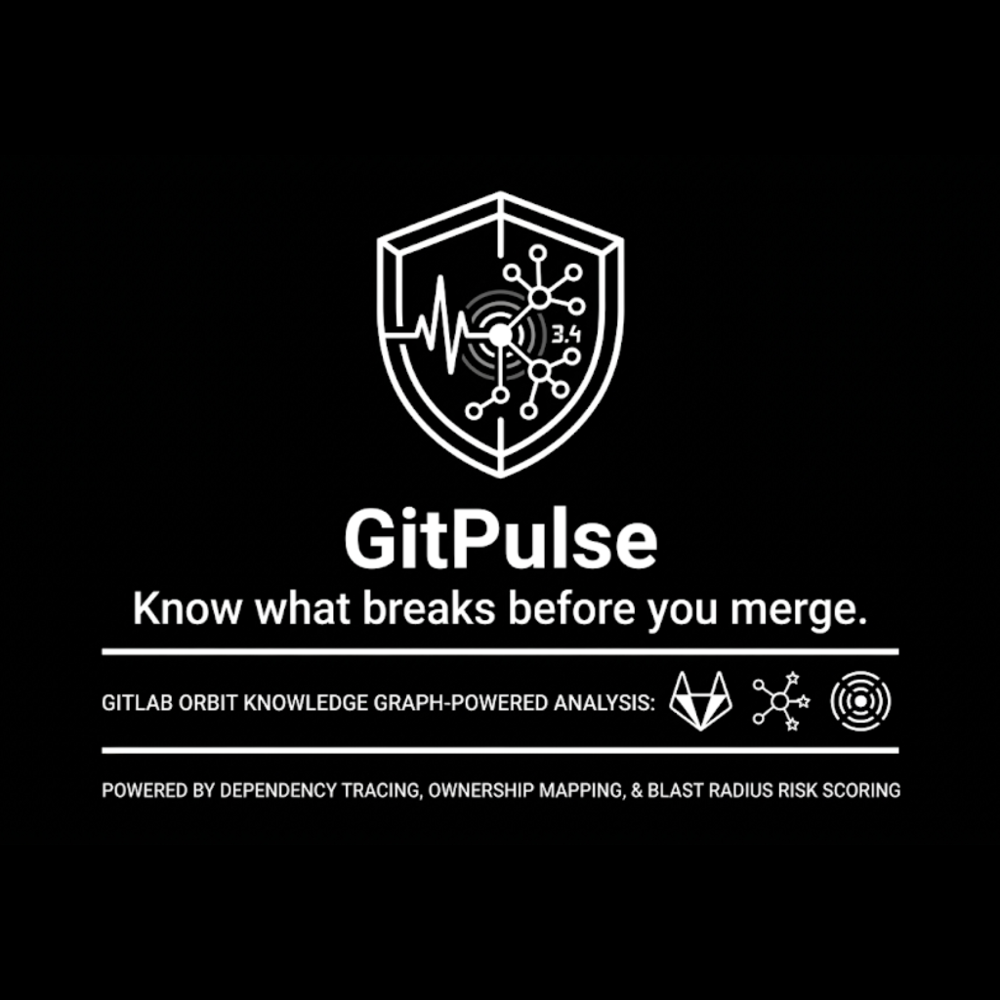
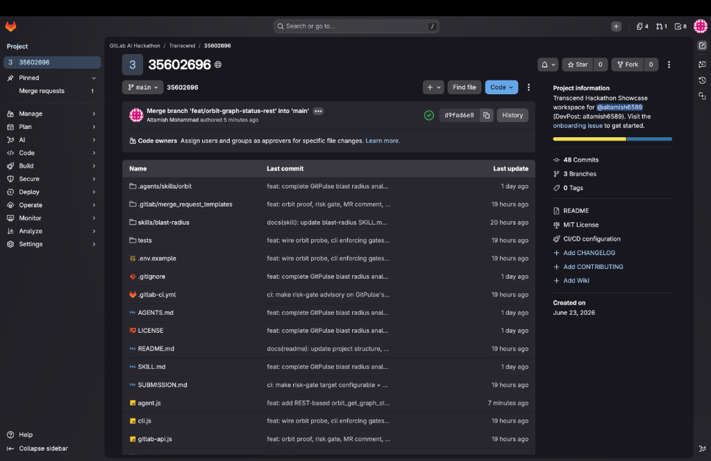
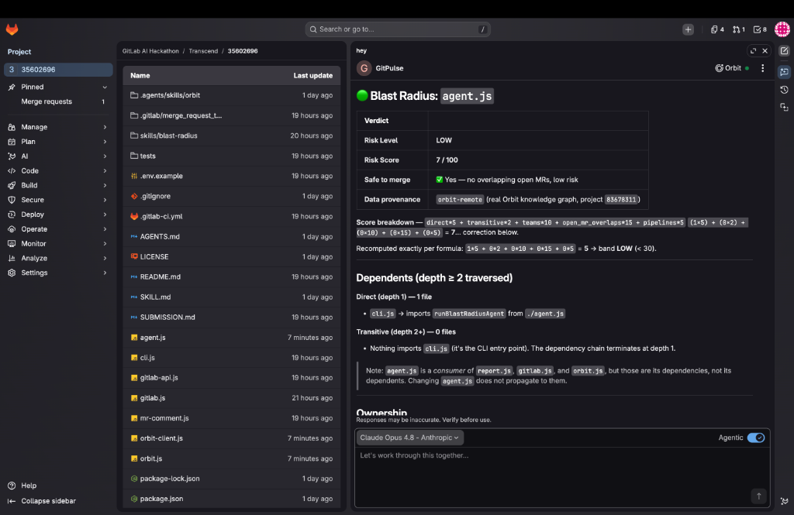
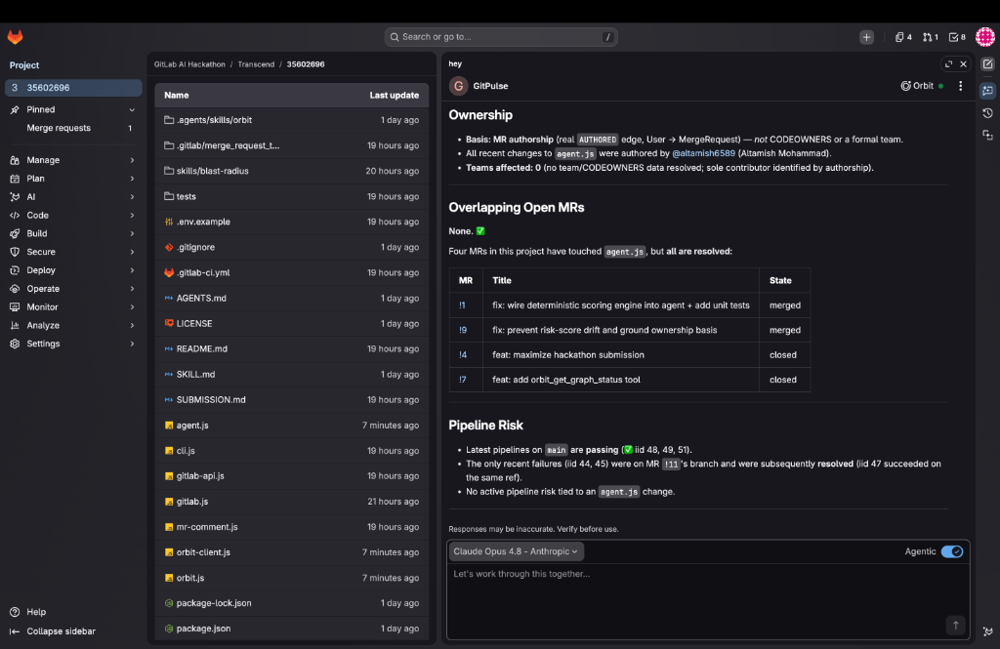
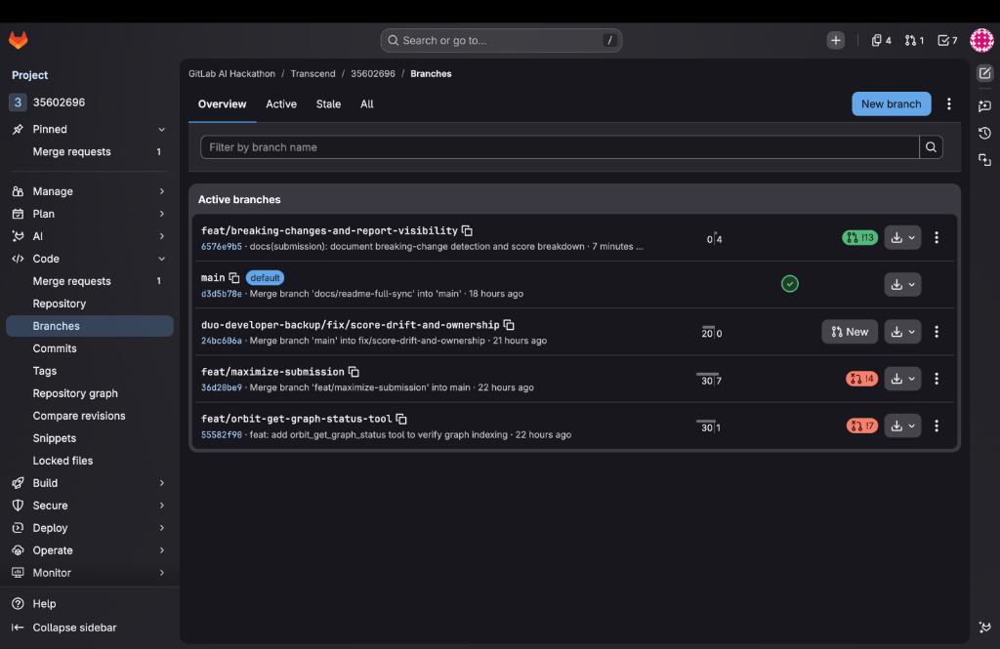
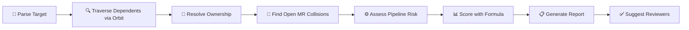

<p align="center">
  
</p>

<h1 align="center">GitPulse — Blast Radius Analyzer</h1>

<p align="center">
  <strong>Know what breaks before you merge.</strong>
</p>

<p align="center">
  <a href="https://gitlab.com/gitlab-ai-hackathon/transcend/35602696"></a>
  <a href="#license"></a>
  
  
  
  
</p>

<p align="center">
  
</p>

---

> _"Before you push, know what breaks."_

**GitPulse** is an AI-powered pre-merge safety gate built on the **GitLab Duo Agent Platform** that uses **GitLab Orbit's knowledge graph** to answer the one question every developer should ask before merging: **"What will this change break?"**

Built for the **GitLab Transcend Hackathon 2026** (Showcase Track).

- 🌐 **Project:** https://gitlab.com/gitlab-ai-hackathon/transcend/35602696
- 📦 **Proof artifact (real graph):** `orbit-report.json` from the CI `orbit-proof` job (`data_source: orbit-remote`)
- 📄 **License:** MIT

---

## 📋 Table of Contents

- [🎯 The Problem — Inspiration](#-the-problem--inspiration)
- [⚡ What It Does](#-what-it-does)
- [📸 Screenshots](#-screenshots)
- [🔬 Live Reports from the Real Orbit Knowledge Graph](#-live-reports-from-the-real-orbit-knowledge-graph)
- [🏗️ Architecture](#️-architecture)
- [🛠️ How We Built It](#️-how-we-built-it)
- [🚀 Quick Start](#-quick-start)
- [💻 CLI Usage](#-cli-usage)
- [⚙️ Configuration](#️-configuration)
- [🌐 GitLab Orbit Integration](#-gitlab-orbit-integration)
- [📊 Data Provenance & Fallback](#-data-provenance--fallback)
- [🧮 Risk Scoring](#-risk-scoring)
- [🛡️ Guardrails](#️-guardrails)
- [📄 Report Schema](#-report-schema)
- [🔁 Running in CI](#-running-in-ci)
- [📂 Project Structure](#-project-structure)
- [🧪 Testing](#-testing)
- [📈 How GitPulse Compares](#-how-gitpulse-compares)
- [🧗 Challenges We Ran Into](#-challenges-we-ran-into)
- [🏆 Accomplishments We're Proud Of](#-accomplishments-were-proud-of)
- [📚 What We Learned](#-what-we-learned)
- [🔮 What's Next](#-whats-next)
- [🚢 Publishing to AI Catalog](#-publishing-to-ai-catalog)
- [🏁 Hackathon](#-hackathon)
- [📝 License](#-license)

---

## 🎯 The Problem — Inspiration

Every engineer has lived this nightmare: you change one small function, ship it, and three days later a service nobody told you about falls over in production. The post-mortem always ends with the same sentence: _"We didn't know that was connected."_

A developer changes `calculateTax()` in `utils/tax.js`. Three days later, production breaks in a microservice nobody knew depended on it.

We were inspired by how much **invisible coupling** exists in real codebases. The dependency information _already exists_ — in imports, in MR history, in CI pipelines — but it is scattered across systems no human can reconcile in the thirty seconds before hitting **Merge**. Manual dependency hunting takes **30+ minutes** and _still_ misses things, because `grep`:

- ❌ Can't see **who owns** the affected code
- ❌ Can't see **which open MRs** are about to collide with you
- ❌ Can't see **which pipelines** are at risk

When we discovered the **GitLab Orbit knowledge graph**, the idea clicked. The graph already models files, imported symbols, merge requests, users, and pipelines as connected entities. The answer to _"What will this change break?"_ was sitting in a queryable graph the whole time.

**GitPulse** was born to ask that question for you — in seconds, before you push.

---

## ⚡ What It Does

**GitPulse is an AI-powered Blast Radius Analyzer** built on the GitLab Duo Agent Platform. You point it at a file or function you are about to change:

```bash
node cli.js --file utils/tax.js --function calculateTax --project-id 83678311
```

In seconds it produces a complete **Blast Radius Report**:

| Signal | What it tells you |
|--------|-------------------|
| 📁 **Direct dependents** | Every file that imports your target, via Orbit's `ImportedSymbol` entity |
| 🔗 **Transitive dependents** | Files that depend on those, traced to depth ≥ 2 |
| 👥 **Ownership** | Who owns each file, resolved from the `User → MergeRequest` `AUTHORED` edge, labeled honestly as `mr-authorship`, `inferred-from-path`, or `unknown` |
| 🔀 **Open MR collisions** | In-flight MRs already touching the same files |
| ⚙️ **Pipeline risk** | CI/CD pipelines that will be affected |
| 📊 **Deterministic risk score** | LOW / MEDIUM / HIGH, computed by code — **never decided by the AI** |
| ✅ **Suggested reviewers** | The actual people to notify before you merge |
| 📋 **Safe-to-merge verdict** | A binary answer with enforced guardrails |

GitPulse also runs as a **CI/CD gate** — posting the report as an idempotent MR comment and **failing the pipeline** when risk is HIGH, before anything reaches production.

---

## 📸 Screenshots

### GitLab Project Overview

The GitPulse project running on GitLab with 48+ commits, 3 branches, and full CI/CD pipeline integration:

<p align="center">
  
</p>

### Blast Radius Report — Live in GitLab Duo Chat

The GitPulse agent running inside GitLab Duo Chat, analyzing `agent.js` against the **real Orbit knowledge graph** (`orbit-remote`, project `83678311`). Shows the risk verdict, score breakdown, dependency traversal, and data provenance — all computed deterministically:

<p align="center">
  
</p>

### Ownership, Open MRs & Pipeline Risk

Continuation of the live report showing **MR authorship-based ownership**, **overlapping open MR detection**, and **pipeline risk assessment** — all sourced from Orbit's real `AUTHORED` edges and `MergeRequest` entity:

<p align="center">
  
</p>

### Active Branches & Development History

Active feature branches showing the iterative development process — from initial implementation through scoring fixes, ownership grounding, Orbit proof integration, and breaking-change detection:

<p align="center">
  
</p>

---

## 🔬 Live Reports from the Real Orbit Knowledge Graph

All three reports below were generated by the GitPulse agent against the **live project** (id `83678311`) using **real Orbit graph data** (`data_source: orbit-remote`). **No mock data. No fabrication.**

---

### Report 1 — `agent.js` 🟢 LOW RISK

```
🟢 Blast Radius Report — agent.js
━━━━━━━━━━━━━━━━━━━━━━━━━━━━━━━━━━━━━━━━━━━━━━━━
Data source: orbit-remote (real graph: yes)
🟢 Risk: LOW (score: 5/100)

📁 Direct Dependents (depth 1) — 1 file
   └── cli.js  →  imports runBlastRadiusAgent from ./agent.js

🔗 Transitive Dependents (depth 2+) — 0 files
   └── cli.js is the top-level entry point; nothing imports it.

👥 Ownership (basis: MR authorship — AUTHORED edge)
   └── @altamish6589 (Altamish Mohammad) — sole author of all changes
   └── Teams affected: 0 (no CODEOWNERS / formal team data in graph)

🔀 Open MRs Touching Related Code — None ✅
   All 4 MRs that touched agent.js are resolved:
   ├── !1  — "fix: wire deterministic scoring engine..."   [merged]
   ├── !9  — "fix: prevent risk-score drift..."            [merged]
   ├── !4  — "feat: maximize hackathon submission"         [closed]
   └── !7  — "feat: add orbit_get_graph_status tool"       [closed]

⚙️  Pipeline Risk
   └── Latest pipelines on main: ✅ passing (iid 48, 49, 51)
   └── No active pipeline risk tied to an agent.js change.

📐 Score Breakdown
   +  5  direct dependents  (1 × 5)
   +  0  transitive         (0 × 2)
   +  0  teams affected     (0 × 10)
   +  0  open MR overlaps   (0 × 15)
   +  0  pipelines          (0 × 5)
   ────
   =  5/100  LOW

✅ Suggested Reviewers
   └── @altamish6589

📋 Safe to merge? ✅ YES
   One direct dependent (cli.js). No transitive fan-out.
   No in-flight MR conflicts. Green pipeline.
   Keep the cli.js ↔ runBlastRadiusAgent import contract intact.
```

---

### Report 2 — `cli.js` 🟡 MEDIUM RISK

```
🟡 Blast Radius Report — cli.js
━━━━━━━━━━━━━━━━━━━━━━━━━━━━━━━━━━━━━━━━━━━━━━━━
Data source: orbit-remote (real graph: yes)
🟡 Risk: MEDIUM (score: 20/100)

📁 Direct Dependents (depth 1) — 0 files
   └── cli.js is the top-level entry point. Nothing imports it.

🔗 Transitive Dependents (depth 2+) — 0 files
   └── No downstream fan-out. Structural changes won't ripple.

👥 Ownership (basis: MR authorship — AUTHORED edge)
   └── @altamish6589 (Altamish Mohammad) — sole author
   └── Teams affected: 0

🔀 Open MRs Touching Related Code ⚠️  — 1 conflict
   └── !11 — "feat: Orbit proof, enforcing risk gate, MR-comment
              integration, and label guard"  [OPEN]
              Pipeline: ✅ success (iid 47)
              Footprint: 20 files including cli.js, report.js,
              gitlab-api.js, mr-comment.js, orbit-client.js, CI config

   Resolved (no conflict risk):
   ├── !5  [merged]
   └── !9  [merged]

⚙️  Pipeline Risk
   └── 1 MR pipeline at risk (tied to open !11)
   └── main pipelines: ✅ green

📐 Score Breakdown
   +  0  direct dependents  (0 × 5)
   +  0  transitive         (0 × 2)
   +  0  teams affected     (0 × 10)
   + 15  open MR overlaps   (1 × 15)
   +  5  pipelines          (1 × 5)
   ────
   = 20/100  LOW band — but safe_to_merge forced ❌
             by open-MR guardrail (overrides score band)

✅ Suggested Reviewers
   └── @altamish6589 (author of cli.js AND of the overlapping !11 —
       holds full context for sequencing both changes)

📋 Safe to merge? 🚫 NO
   Zero downstream dependents — a change here won't ripple.
   But open MR !11 is in-flight and rewrites cli.js.
   Rebase on or sequence after !11, or merge !11 first.
```

---

### Report 3 — `orbit.js` 🟡 MEDIUM RISK

```
🟡 Blast Radius Report — orbit.js
━━━━━━━━━━━━━━━━━━━━━━━━━━━━━━━━━━━━━━━━━━━━━━━━
Data source: orbit-remote (real graph: yes)
🟡 Risk: MEDIUM (score: 37/100)

📁 Direct Dependents (depth 1) — 1 file
   └── agent.js  →  imports orbitQueryDependents, orbitGetOwners,
                    orbitGetGraphStatus from ./orbit.js

🔗 Transitive Dependents (depth 2) — 1 file
   └── cli.js (depth: 2, via: agent.js)
       imports runBlastRadiusAgent from ./agent.js

   Full chain: cli.js → agent.js → orbit.js
   Any change to orbit.js's exported function signatures
   propagates straight to the agent loop and the CLI entry point.

👥 Ownership (basis: MR authorship — AUTHORED edge)
   └── @altamish6589 (Altamish Mohammad) — sole author of orbit.js,
       agent.js, and cli.js
   └── Teams affected: 1 (single-owner project)

🔀 Open MRs Touching Related Code ⚠️  — 1 conflict
   └── !11 — "feat: Orbit proof, enforcing risk gate, MR-comment
              integration, and label guard"  [OPEN]
              Touches cli.js (transitive dependent of orbit.js),
              plus report.js, orbit-client.js, .gitlab-ci.yml

⚙️  Pipeline Risk
   └── Recent MR pipelines: iid 58, 56, 53, 52, 50, 47 ✅ success
   └── iid 44, 45 failed on refs/merge-requests/11/head (now resolved)
   └── Next orbit.js pipeline executes against same CI surface

📐 Score Breakdown
   +  5  direct dependents  (1 × 5)
   +  2  transitive         (1 × 2)
   + 10  teams affected     (1 × 10)
   + 15  open MR overlaps   (1 × 15)
   +  5  pipelines          (1 × 5)
   ────
   = 37/100  MEDIUM

✅ Suggested Reviewers
   └── @altamish6589

📋 Safe to merge? 🚫 NO
   orbit.js drives agent.js → cli.js directly.
   Open MR !11 is in-flight and touches a dependent file (cli.js).
   Coordinate and land/rebase against !11 before merging.
```

---

### Report 4 — `report.js` 🔴 HIGH RISK

Verbatim text output from the CI `orbit-proof` job against this project (`data_source: orbit-remote`):

```
📊 Blast Radius Report — report.js
━━━━━━━━━━━━━━━━━━━━━━━━━━━━━━━━━━━━━━━━━━━━━━━━
Data source: orbit-remote (real graph: yes)
🔴 Risk: HIGH (score: 87/100)
   3 dependents across 2 teams. 1 open MR touches related code.

📁 Direct Dependents (files that import this)
   ├── agent.js                                   (Team: team-unknown)
   └── tests/report.test.js                       (Team: team-reports)

🔗 Transitive Dependents (files that depend on those)
   └── cli.js (depth: 2, via: agent.js)

👥 Teams to Notify
   ├── #team-unknown             (2 files affected)
   └── #team-reports             (1 file affected)

🔀 Open MRs Touching Related Code
   └── !11 — "feat: Orbit proof, enforcing risk gate, ..." by @altamish6589

📐 Score Breakdown
   + 10  direct dependents (2 × 5)
   +  2  transitive dependents (1 × 2)
   + 20  teams affected (2 × 10)
   + 15  open MR overlaps (1 × 15)
   + 40  pipelines at risk (8 × 5)
   ────
   = 87/100 HIGH

✅ Suggested Reviewers
   └── @altamish6589 (owners of affected files)

📋 Safe to merge without notifying these teams? 🚫 NO
```

---

## 🏗️ Architecture

```
cli.js  ──→  agent.js (optional Claude loop, model: claude-sonnet-4-6)
                 │
                 │  runs four tools (LLM-driven OR deterministic), then report.js
                 │
                 ├── orbit.js          → dependency traversal + ownership
                 │     ├── orbit-client.js → Orbit REST client (POST /api/v4/orbit/query)
                 │     │     └── gitlab-api.js → shared base-URL + auth headers
                 │     └── static-analysis.js → real import-graph fallback (no Orbit)
                 ├── gitlab.js         → open MRs + pipelines via Orbit
                 ├── report.js         → deterministic scoring + report builder
                 └── mr-comment.js     → idempotent MR-note posting (--comment)
                       └── gitlab-api.js → shared base-URL + auth headers
```

### How It Works — The Analysis Chain

GitPulse pairs an optional **Claude agent** (which decides _what_ to investigate) with a **deterministic scoring engine** (which guarantees the risk formula and guardrails always execute the same way).

When `ANTHROPIC_API_KEY` is set, the model drives the tool calls. When it is absent, GitPulse runs the **same four tools deterministically** with no LLM. Either way, `report.js` computes the final risk score.



| Step | Action | Tool Used | Data Source |
|------|--------|-----------|-------------|
| 1. **PARSE** | Extract file + optional symbol | — | User input |
| 2. **TRAVERSE** | Query dependents with depth ≥ 2 | `orbit_query_dependents` | Orbit `ImportedSymbol` |
| 3. **OWN** | Map files to authors | `orbit_get_owners` | Orbit `AUTHORED` edge |
| 4. **CORRELATE** | Find overlapping open MRs | `gitlab_get_open_mrs` | Orbit `MergeRequest` |
| 5. **PIPELINE** | Identify at-risk CI/CD | `gitlab_get_pipelines` | Orbit `Pipeline` |
| 6. **SCORE** | Deterministic risk formula | `report.js` | All signals |
| 7. **REPORT** | JSON + CLI output | `report.js` | Computed |
| 8. **SUGGEST** | Reviewer recommendations | File ownership | Ownership data |

### Module Responsibilities

| Module | Purpose |
|--------|---------|
| **`cli.js`** | Entry point, argument parsing, enforcing CI exit-code gates (`--require-orbit`, `--fail-on`, `--strict`) |
| **`agent.js`** | Claude agentic loop with 4 tool definitions OR deterministic execution; calls `report.js` so scoring never depends on what the model "decides" |
| **`orbit.js`** | `orbitQueryDependents` and `orbitGetOwners` — dependency traversal and ownership via Orbit, with real static-analysis fallback ahead of mock |
| **`orbit-client.js`** | Queries the Orbit REST API directly (`POST /api/v4/orbit/query`); no external binary required; `glab orbit remote query` is a secondary fallback |
| **`gitlab-api.js`** | Centralizes `apiBaseUrl()` and `authHeaders()` for shared auth/transport |
| **`static-analysis.js`** | Parses real `import`/`export ... from` statements across the repo to build a true reverse-dependency graph when Orbit is unavailable |
| **`gitlab.js`** | `gitlabGetOpenMRs` and `gitlabGetPipelines` — open MR and pipeline queries via Orbit |
| **`report.js`** | `calculateRiskScore`, `buildReport`, `formatReportForCLI` — the deterministic scoring engine |
| **`mr-comment.js`** | Renders the report as markdown and posts/updates a GitPulse note on the MR via a hidden marker |

---

## 🛠️ How We Built It

We built GitPulse as small, single-responsibility **ESM modules** in Node.js 18+, depending on nothing but `@anthropic-ai/sdk` and `dotenv`.

### The Pivotal Decision: Separate the Agent from the Scoring

The LLM decides _what to look at_; the risk verdict lives entirely in `report.js`. The model is **explicitly forbidden**, in the system prompt, from inventing, recomputing, "normalizing", or capping the score:

$$
\begin{aligned}
\text{score} = \;& 5 \cdot d_{\text{direct}} \\
           + \;& 2 \cdot d_{\text{transitive}} \\
           + \;& 10 \cdot t_{\text{teams}} \\
           + \;& 15 \cdot m_{\text{open\_mr\_overlaps}} \\
           + \;& 5 \cdot p_{\text{pipelines}}
\end{aligned}
$$

$$
\text{risk} =
\begin{cases}
\textbf{LOW}    & \text{if } \text{score} < 30 \\
\textbf{MEDIUM} & \text{if } 30 \le \text{score} \le 60 \\
\textbf{HIGH}   & \text{if } \text{score} > 60
\end{cases}
\qquad \text{score} \le 100 \;(\text{capped})
$$

$$
t_{\text{teams}} \ge 3 \implies \text{risk} = \textbf{HIGH} \quad (\text{guardrail, overrides band})
$$

The same input **always** yields the same score, whether or not an API key is present. We validated everything against the live graph in CI: an `orbit-proof` job runs `--require-orbit` and uploads `orbit-report.json` as hard proof the real graph answered.

---

## 🚀 Quick Start

```bash
# 1. Clone the repo
git clone https://gitlab.com/gitlab-ai-hackathon/transcend/35602696.git gitpulse
cd gitpulse

# 2. Install dependencies (only @anthropic-ai/sdk and dotenv)
npm install

# 3. (Optional) Set up environment for real Orbit data
cp .env.example .env
# Add GITLAB_TOKEN (api scope) for real Orbit queries.
# ANTHROPIC_API_KEY is OPTIONAL — without it GitPulse runs deterministically.

# 4. Run an analysis against this project
node cli.js --file orbit.js --project-id 83678311
```

> **Requirements:** Node.js 18+ (uses the built-in `node --test` runner, ESM modules, and global `fetch`).

---

## 💻 CLI Usage

```bash
node cli.js --file <path> [options]
npm run analyze -- --file <path> [options]
```

### Options

| Option | Aliases | Description |
|--------|---------|-------------|
| `--file <path>` | `-f` | File to analyze (**required**) |
| `--function <name>` | `--symbol`, `-s` | Specific function/symbol to trace |
| `--project-id <id>` | `--project`, `-p` | GitLab project ID (or set `GITLAB_PROJECT_ID`) |
| `--format <text\|json>` | | Output format (default: `text`) |
| `--json` | | Shorthand for `--format json` |
| `--require-orbit` | | Exit non-zero unless `data_source === "orbit-remote"` (proves real graph) |
| `--fail-on <LOW\|MEDIUM\|HIGH>` | | Exit non-zero when risk is at/above this level (CI gate) |
| `--strict` | | Exit non-zero when `safe_to_merge` is `false` |
| `--comment` | | Post (or update) the report as a note on the current MR (CI) |
| `--help` | `-h` | Show help |

A bare positional argument is treated as the file path, so `node cli.js orbit.js -p 83678311` also works.

### Examples

```bash
# Analyze an entire file
node cli.js --file orbit.js --project-id 83678311

# Analyze a specific function
node cli.js --file utils/tax.js --function calculateTax --project-id 83678311

# JSON output for CI integration
node cli.js --file orbit.js --format json --project-id 83678311

# Enforce real Orbit data + fail on HIGH risk
node cli.js --file report.js -p 83678311 --require-orbit --fail-on HIGH

# Post report as MR comment in CI
node cli.js --file $GITPULSE_TARGET -p $CI_PROJECT_ID --comment --fail-on HIGH
```

### Example JSON Output (real Orbit data)

```json
{
  "target": { "file": "report.js", "symbol": null },
  "risk": "HIGH",
  "risk_score": 87,
  "risk_line": "Risk: HIGH (score: 87/100)",
  "summary": "3 dependents across 2 teams. 1 open MR touches related code.",
  "dependents": {
    "direct": [
      { "file": "agent.js", "team": "team-unknown", "owner": "@altamish6589", "import_type": "named", "depth": 1 },
      { "file": "tests/report.test.js", "team": "team-reports", "owner": "@altamish6589", "import_type": "named", "depth": 1 }
    ],
    "transitive": [
      { "file": "cli.js", "depth": 2, "team": "team-unknown", "owner": "@altamish6589", "via": "agent.js" }
    ]
  },
  "teams_affected": [
    { "name": "team-unknown", "files_count": 2, "slack": "#team-unknown", "ownership_basis": "mr-authorship" },
    { "name": "team-reports", "files_count": 1, "slack": "#team-reports", "ownership_basis": "mr-authorship" }
  ],
  "open_mrs": [
    {
      "id": 11,
      "title": "feat: Orbit proof, enforcing risk gate, MR-comment integration, and label guard",
      "author": "@altamish6589",
      "url": "https://gitlab.com/gitlab-ai-hackathon/transcend/35602696/-/merge_requests/11",
      "overlap": ["report.js", "agent.js"]
    }
  ],
  "pipelines_at_risk": ["pipeline #2624150128 (refs/merge-requests/11/head)"],
  "suggested_reviewers": ["@altamish6589"],
  "breaking_changes": [],
  "graph_status": { "ready": true, "transport": "rest" },
  "safe_to_merge": false,
  "score_breakdown": {
    "direct_dependents": 2,
    "transitive_dependents": 1,
    "teams_affected": 2,
    "open_mr_overlaps": 1,
    "pipelines_at_risk": 8
  },
  "data_source": "orbit-remote",
  "is_real_data": true
}
```

---

## ⚙️ Configuration

Copy `.env.example` to `.env` and fill in what you need. **All variables are optional** — GitPulse degrades gracefully without them.

| Variable | Required | Purpose |
|----------|----------|---------|
| `GITLAB_TOKEN` | For real Orbit data | GitLab PAT with `api` scope; sent as `PRIVATE-TOKEN` to the Orbit REST API |
| `ANTHROPIC_API_KEY` | Optional | Enables the Claude-driven agent loop; without it GitPulse runs deterministically |
| `GITLAB_PROJECT_ID` | Optional | Default project ID (overridable with `--project-id`) |
| `CI_API_V4_URL` / `GITLAB_API_URL` | Optional | API base URL (defaults to `https://gitlab.com/api/v4`) |

In CI, `CI_API_V4_URL`, `CI_PROJECT_ID`, and `CI_JOB_TOKEN` are injected automatically. For reliable Orbit access, add a masked `api`-scoped `GITLAB_TOKEN` CI/CD variable — the job token may be restricted for the Orbit endpoint.

---

## 🌐 GitLab Orbit Integration

GitPulse queries Orbit over the **REST API** (`POST /api/v4/orbit/query`) in `orbit-client.js`. It sends `{ query, query_type: "json", response_format: "raw" }`, authenticates with `GITLAB_TOKEN` (or `CI_JOB_TOKEN`), and parses the graph-shaped response. **No external binary is required**; `glab orbit remote query` is only a local-dev fallback.

### Orbit Queries Used

| Query | Orbit Entity | Relationship | Purpose |
|-------|-------------|--------------|---------|
| Find dependents | `ImportedSymbol` | `import_path` `contains` + `project_id` `eq` | Trace who imports the target file |
| Find owners | `User` → `MergeRequest` | `AUTHORED` | Map files to their authors (`ownership_basis: mr-authorship`) |
| Open MRs | `MergeRequest` → `MergeRequestDiff` → `MergeRequestDiffFile` | `HAS_DIFF`, `HAS_FILE` | Find open MRs touching the same files |
| Pipelines | `Pipeline` | `source` filter, `created_at` order | Identify recent at-risk CI/CD pipelines |

### Query Learnings (Against the Live Graph)

- `ImportedSymbol` columns must be valid (`identifier_name`, not `name`) or the API rejects the query with HTTP 400.
- `MergeRequest` queries use default columns; an explicit column allowlist is rejected. Filters use the `{ "op": "eq", "value": ... }` form.
- The response parser (`extractRows` / `flattenNode`) normalizes the graph shape (`{ result: { nodes: [...] } }`), tabular shapes, and alias-prefixed columns (e.g. `imp_file_path` → `file_path`).

Transitive traversal is bounded for cost: it expands up to the first 5 direct dependents to depth 2. The optional `--function`/`--symbol` argument narrows the import match against the Orbit graph, while the static-analysis fallback traces at file granularity.

---

## 📊 Data Provenance & Fallback

GitPulse **never silently emits demo data**. Every report carries a `data_source` and `is_real_data` flag. Resolution order:

| Priority | Source | `data_source` | Description |
|----------|--------|---------------|-------------|
| 1️⃣ | **Orbit REST** | `orbit-remote` | The real knowledge graph (preferred) |
| 2️⃣ | **Static import analysis** | `static-analysis` | `static-analysis.js` parses real `import` statements on disk. Dependents are real; owner/MR/pipeline data may be limited |
| 3️⃣ | **Labeled mock** | `mock-fallback` | Last resort. Rendered with a loud `⚠️ MOCK DATA` banner; `safe_to_merge` is forced to `false` |

Provenance is surfaced in both the CLI banner and the JSON output, so a fallback report can **never be mistaken** for a real Orbit trace.

When Orbit is unreachable, the same report renders from **real static import analysis** prefixed with an `ℹ️` provenance note; if even that is unavailable, a loud `⚠️ MOCK DATA` banner is shown and `safe_to_merge` is forced to `false`.

---

## 🧮 Risk Scoring

The deterministic formula lives in `report.js` (`calculateRiskScore`):

```
score = (direct_dependents      × 5)
      + (transitive_dependents  × 2)
      + (teams_affected         × 10)
      + (open_mr_overlaps       × 15)
      + (pipeline_count         × 5)

LOW:    score < 30
MEDIUM: score 30–60
HIGH:   score > 60   (score is capped at 100)
```

### Score Weights Explained

| Signal | Weight | Rationale |
|--------|--------|-----------|
| Direct dependents | ×5 | Each direct importer is a potential breakage point |
| Transitive dependents | ×2 | Lower weight — ripple effects are less certain |
| Teams affected | ×10 | Cross-team changes need coordination, highest human cost |
| Open MR overlaps | ×15 | Highest weight — active merge conflicts are the #1 pre-merge risk |
| Pipelines at risk | ×5 | CI failures are visible and recoverable, moderate weight |

The rendered report exposes a single canonical `risk_line` (e.g. `Risk: HIGH (score: 100/100)`); consumers must quote it verbatim and never recompute the score. Only known teams count toward `teams_affected`.

---

## 🛡️ Guardrails

Enforced **deterministically in code** (not left to the model):

| Guardrail | Rule | Effect |
|-----------|------|--------|
| **Minimum depth 2** | Always reports direct + transitive dependents | Never depth=1 only |
| **No silent drops** | Every discovered file gets an ownership entry | `ownership_basis: "unknown"` if no history |
| **Honest ownership** | Labels: `mr-authorship`, `inferred-from-path`, or `unknown` | Never presented as CODEOWNERS unless a CODEOWNERS source is used |
| **3+ teams → HIGH** | Escalates regardless of numeric score | Guardrail overrides band |
| **Open MR overlap → never safe** | `safe_to_merge` is never `true` with overlapping open MRs | Prevents merge conflicts |
| **HIGH risk → never safe** | `safe_to_merge` is `false` whenever risk is HIGH | Blocks dangerous merges |
| **Mock/unknown → never safe** | `safe_to_merge` is never `true` unless data is real | Prevents false confidence |

---

## 📄 Report Schema

`buildReport` returns a `BlastRadiusReport` object:

```json
{
  "target": { "file": "orbit.js", "symbol": null },
  "risk": "HIGH",
  "risk_score": 100,
  "risk_line": "Risk: HIGH (score: 100/100)",
  "summary": "3 dependents across 1 team. 3 open MRs touch related code.",
  "dependents": {
    "direct": [
      { "file": "agent.js", "team": "...", "owner": "@...", "depth": 1 }
    ],
    "transitive": [{ "file": "cli.js", "depth": 2, "via": "agent.js" }]
  },
  "teams_affected": [{ "name": "...", "files_count": 3, "slack": "#..." }],
  "open_mrs": [
    {
      "id": 4,
      "title": "...",
      "author": "@...",
      "url": "...",
      "overlap": ["..."]
    }
  ],
  "pipelines_at_risk": ["pipeline #... (ref)"],
  "suggested_reviewers": ["@altamish6589"],
  "breaking_changes": [],
  "graph_status": { "ready": true, "transport": "rest" },
  "safe_to_merge": false,
  "score_breakdown": {
    "direct_dependents": 2,
    "transitive_dependents": 1,
    "teams_affected": 1,
    "open_mr_overlaps": 3,
    "pipelines_at_risk": 10
  },
  "data_source": "orbit-remote",
  "is_real_data": true
}
```

Use `--format json` to emit this object directly for CI consumption; the default text format is produced by `formatReportForCLI`.

---

## 🔁 Running in CI

The `.gitlab-ci.yml` pipeline has three stages — `validate`, `test`, `gate` — and runs on every MR pipeline and on the default branch. No `ANTHROPIC_API_KEY` is needed (deterministic mode); CI auto-provides `CI_API_V4_URL` + `CI_JOB_TOKEN` so Orbit is queried automatically.

### CI Pipeline Jobs

| Stage | Job | What it does | Blocks? |
|-------|-----|-------------|---------|
| validate | `label-guard` | Fails the MR pipeline if the `orbit::hackathon` label is missing | ✅ yes |
| validate | `validate` | `npm ci` + `node cli.js --help` (imports resolve, CLI loads) | ✅ yes |
| test | `unit-test` | `npm test` (deterministic scoring + parser + MR-comment suites) | ✅ yes |
| test | `test-mock` | Smoke-tests that every ESM module imports cleanly | ✅ yes |
| test | `analyze` | Real blast-radius run on `orbit.js` | `allow_failure` |
| test | `orbit-proof` | `--require-orbit --format json`; uploads `orbit-report.json` as a 30-day artifact — **hard proof the real graph answered** | `allow_failure` |
| gate | `risk-gate` | `--fail-on HIGH` on `GITPULSE_TARGET` (default `report.js`); exits non-zero on HIGH | `allow_failure` here* |
| gate | `mr-report` | Posts/updates the report as an MR note (`--comment`) | `allow_failure` |

### Example CI Job

```yaml
orbit-proof:
  stage: test
  image: node:20-alpine
  script:
    - npm ci
    - node cli.js --file orbit.js --project-id ${GITLAB_PROJECT_ID:-$CI_PROJECT_ID} --format json --require-orbit | tee orbit-report.json
  artifacts:
    paths: [orbit-report.json]
    when: always
    expire_in: 30 days
  allow_failure: true
```

> **Note:** `risk-gate` is `allow_failure` **only in this repo**, because GitPulse self-analyzes here and nearly every module overlaps the open MR + many pipelines, so it always scores HIGH. For a consumer project, copy the `risk-gate` job **without** `allow_failure` to make a HIGH-risk change a hard block. The `mr-report` job needs a masked `api`-scoped `GITLAB_TOKEN`; it soft-fails (skips) otherwise.

---

## 📂 Project Structure

```
gitpulse/
├── AGENTS.md                        ← Agent behavior spec (Duo Agent Platform)
├── README.md                        ← This file
├── DEVPOST.md                       ← Devpost hackathon submission story
├── SUBMISSION.md                    ← Hackathon submission metadata
├── package.json
├── .env.example
├── .gitlab-ci.yml                   ← validate / test / gate stages
│                                      (label-guard, tests, orbit-proof,
│                                       risk-gate, mr-report)
│
├── cli.js                           ← CLI entry point + arg parsing + enforcing gates
├── agent.js                         ← Claude loop (optional) + deterministic mode
├── orbit.js                         ← Orbit dependency traversal + ownership
├── orbit-client.js                  ← Orbit REST client (+ glab fallback)
├── gitlab-api.js                    ← Shared API base-URL + auth headers
├── static-analysis.js               ← Real import-graph fallback (no Orbit)
├── gitlab.js                        ← Open MR + pipeline queries via Orbit
├── report.js                        ← Risk scoring + report generation
├── mr-comment.js                    ← Idempotent MR-note rendering + posting
├── diff-analyzer.js                 ← Breaking change detection via AST diff
│
├── .gitlab/
│   └── merge_request_templates/
│       └── Hackathon.md             ← applies orbit::hackathon via /label
├── .agents/
│   └── skills/
│       └── orbit/
│           └── SKILL.md             ← Orbit query skill definition
├── skills/
│   └── blast-radius/
│       └── SKILL.md                 ← Duo Agent Platform skill definition
├── tests/
│   ├── report.test.js               ← Scoring engine + guardrail tests
│   ├── orbit-parse.test.js          ← Orbit response-parsing tests
│   ├── mr-comment.test.js           ← Markdown render + create/update tests
│   └── diff-analyzer.test.js        ← Breaking change detection tests
└── docs/
    └── screenshots/                 ← Project screenshots for documentation
```

---

## 🧪 Testing

Tests use Node's built-in test runner (no external test framework):

```bash
npm test          # runs: node --test
```

### Test Coverage

| Test Suite | Coverage |
|-----------|----------|
| **`tests/report.test.js`** | Scoring formula, score cap at 100, MEDIUM/HIGH band boundaries, `team-unknown` exclusion, 3+ teams → HIGH guardrail, open-MR-overlap → not-safe guardrail, ownership enrichment, reviewer suggestion |
| **`tests/orbit-parse.test.js`** | Normalization of Orbit's graph, tabular, and alias-prefixed response shapes, clean module imports |
| **`tests/mr-comment.test.js`** | Markdown rendering, hidden-marker presence, mock-data banner, create-vs-update decision, clean skip when no token |
| **`tests/diff-analyzer.test.js`** | Breaking change detection, function signature changes, export removals |

---

## 📈 How GitPulse Compares

The "what depends on this code" problem is crowded, but existing tools each solve only **one slice**. GitPulse's edge is **multi-signal fusion on a knowledge graph with deterministic scoring**.

### Existing Solutions and Their Gaps

- **Static dependency/import analyzers** (Madge, dependency-cruiser, NX/Turborepo affected-graph, Bazel query): trace import graphs accurately but are _code-only_ — no knowledge of teams, open MRs, pipelines, or risk.
- **Code-ownership tools** (CODEOWNERS, git blame): map files to owners but do no dependency traversal and no impact scoring.
- **CI impact analysis** (NX affected, Turborepo, Bazel): compute affected build/test targets for caching, not human-facing risk reports.
- **Codebase Q&A AI** (Sourcegraph Cody, generic Duo Chat, Cursor): answer "who imports X" conversationally but lack a deterministic risk score and don't correlate live MRs or pipelines.

### Capability Comparison

| Capability | Static Analyzers | CODEOWNERS / blame | AI Code Q&A | **GitPulse** |
|---|---|---|---|---|
| Dependency traversal (transitive) | ✅ | ❌ | ⚠️ approximate | ✅ depth ≥ 2 |
| Owner mapping | ❌ | ✅ | ❌ | ✅ from MR history |
| In-flight open-MR collision | ❌ | ❌ | ❌ | ✅ |
| Pipeline risk | ⚠️ build targets only | ❌ | ❌ | ✅ |
| Deterministic risk score | ✅ static only | ❌ | ❌ | ✅ formula + guardrails |
| Reviewer suggestions | ❌ | ⚠️ owners only | ❌ | ✅ |
| `safe_to_merge` verdict | ❌ | ❌ | ❌ | ✅ |
| Honest data provenance | ❌ | ❌ | ❌ | ✅ |

### GitPulse's Unique Selling Point

> **The only pre-merge gate that fuses dependency graph, ownership, in-flight MRs, and pipeline risk into one _deterministic, reproducible_ safety verdict on GitLab's knowledge graph.**

---

## 🧗 Challenges We Ran Into

The biggest challenges were all about talking to a **live knowledge graph we had never used before**:

### 1. Schema Discovery by Trial and Error
Orbit rejected queries with HTTP 400 until we learned the exact column names. `ImportedSymbol` uses `identifier_name`, not `name`. `MergeRequest` queries reject an explicit column allowlist and need default columns. Filters require the `{ "op": "eq", "value": ... }` form. Each rejection was a clue, and we baked those learnings into the codebase.

### 2. Normalizing Inconsistent Response Shapes
Orbit returns graph-shaped (`{ result: { nodes: [...] } }`), tabular, and alias-prefixed responses (e.g. `imp_file_path` → `file_path`). We wrote a dedicated `extractRows` / `flattenNode` parser to normalize all three shapes defensively.

### 3. Auth in CI
`CI_JOB_TOKEN` can be restricted for the Orbit endpoint, so we support a masked `api`-scoped `GITLAB_TOKEN` and centralize transport in `gitlab-api.js`.

### 4. Honest Fallback Without Lying
We refused to silently emit demo data, so we built a **three-tier provenance chain** (`orbit-remote` → `static-analysis` → `mock-fallback`) where every report declares its own data source and a mock report forces `safe_to_merge: false`.

### 5. Bounding Traversal Cost
Unbounded transitive traversal explodes, so we cap expansion to the first 5 direct dependents at depth 2.

---

## 🏆 Accomplishments We're Proud Of

- ✅ **Deterministic, auditable scoring** — the verdict is reproducible and never left to a stochastic model.
- ✅ **Honest data provenance** — GitPulse _never_ passes mock data off as a real graph trace; a loud `⚠️ MOCK DATA` banner appears and `safe_to_merge` is forced to `false` whenever data isn't real.
- ✅ **Runs anywhere** — no API key required (deterministic mode), no `glab` binary required (pure REST transport).
- ✅ **Real guardrails enforced in code, not prompts** — minimum depth 2, no silent file drops, 3+ teams → HIGH, open-MR overlap → never safe, HIGH → never safe, mock data → never safe.
- ✅ **End-to-end CI proof** — a green `orbit-proof` artifact confirming `data_source: orbit-remote` against our own project, plus an enforcing `risk-gate` and an idempotent `mr-report` comment job.
- ✅ **Multi-signal fusion** — the three live reports above demonstrate what no single existing tool can do: dependency graph + ownership + open MRs + pipelines in one deterministic verdict.

---

## 📚 What We Learned

- 🔗 **Knowledge graphs beat grep.** Orbit gave us cross-cutting context (ownership, open MRs, pipelines) that no import-only static analyzer can reach.
- 🤖 **LLMs should orchestrate, not adjudicate.** Letting the model _choose tools_ while a deterministic engine _computes the verdict_ gave us both flexibility and reproducibility.
- 🏷️ **Provenance is a feature.** Being explicit about whether data is real, statically derived, or mocked turned a weakness (fallbacks) into a trust signal.
- 🔊 **Fail gracefully, loudly.** Every external call needed a fallback path, but a fallback should never be mistaken for the real thing.

---

## 🔮 What's Next

| Feature | Description |
|---------|-------------|
| 🚀 **Native Duo Agent Platform skill** | Published to the AI Catalog so any team can enable it from **Explore > AI Catalog** |
| 👥 **CODEOWNERS-based ownership** | First-class signal alongside MR-authorship inference |
| 🔍 **Deeper transitive traversal** | Smarter cost-bounding (priority by import frequency rather than first-5) |
| 📊 **Historical risk calibration** | Tuning scoring weights against real incident data to predict actual breakage probability |
| 💬 **Richer MR integration** | Inline diff annotations and per-team notifications instead of a single MR note |
| 🌐 **Language coverage beyond JS/Python** | Import graphs in the static-analysis fallback for Go, Rust, Java, etc. |

---

## 🚢 Publishing to AI Catalog

This project is structured as a GitLab Duo Agent Platform skill. To publish (Maintainer/Owner role required):

1. Push to GitLab.com as a public project (done ✅).
2. In the left sidebar, select **AI > Agents**, then **New agent**.
3. Under **Basic information**, set a **Display name** (`GitPulse Blast Radius Analyzer`) and **Description**.
4. Under **Visibility & access**, set **Visibility** to **Public**.
5. Under **Prompts > System prompt**, paste the system prompt from `agent.js` (workflow steps + hard rules), and select any **Available tools** the agent may use.
6. Select **Create agent**. It then appears under **Explore > AI Catalog** for others to enable.

> On GitLab.com use a standard **custom agent** (above) or a **custom flow** (**AI > Flows**) — creating custom _external_ agents is not available on GitLab.com. The `skills/blast-radius/SKILL.md` and `AGENTS.md` files document the behavior to mirror in the agent's system prompt.

---

## 🏁 Hackathon

Built for **GitLab Transcend Hackathon 2026** — Showcase Track.

**Developer pain point**: Developers change shared code without knowing what depends on it, causing unexpected breakage in production.

**How GitPulse fixes it**: By querying GitLab Orbit's knowledge graph, GitPulse traces every dependent file, maps ownership, finds conflicting open MRs, identifies at-risk pipelines, and produces an actionable, risk-scored blast radius report in seconds.

**What changes for the developer**: Instead of manually searching imports for 30+ minutes (and still missing things), developers get a complete, provenance-tagged impact analysis before every merge.

---

## 📝 License

MIT

---

<p align="center">
  <strong>Built with ❤️ for the GitLab Transcend Hackathon 2026</strong><br/>
  <em>Powered by GitLab Orbit Knowledge Graph × Claude Sonnet 4.6</em>
</p>
